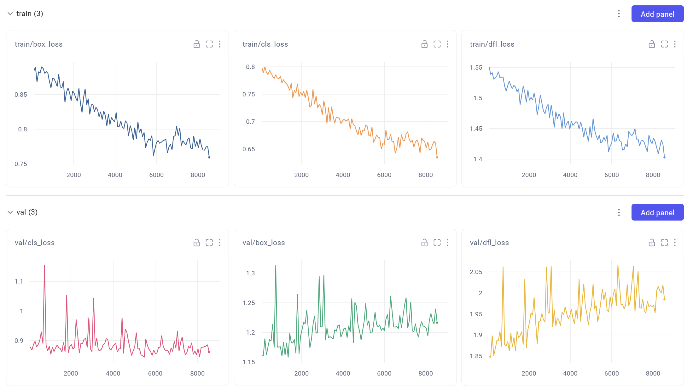

# 环境配置

1. **核心库：**
   1. Pytorch `conda install pytorch torchvision torchaudio pytorch-cuda=12.1 -c pytorch -c nvidia`
   2. Yolov8  `pip install ultralytics`
2. **可选库**
   1. Comet[^1] `pip install comet_ml` 

> [!note]
>
> Comet设置成离线模式时，每次train结束后，先在终端设置API `set COMET_API_KEY=YnYyHOYRurdu1KdGoAetHJxl4`，再按照提示上传本地`.cometml-runs`中的文件即可。**此实验记录已设置为公开，在[此处](https://www.comet.com/etmology/defect-detection-exp/view/new/panels)可查看实验参数、指标、输出、设备信息等。**

# 数据集及其处理

## 原始数据集：[NEU-DET](NEU-DET) 

NEU-DET是[东北大学（NEU）表面缺陷检测数据库（Northeastern University Surface Defect Detection Database）](http://faculty.neu.edu.cn/songkechen/zh_CN/zdylm/263270/list/)。该数据库是一个专门用于表面缺陷检测的数据集，旨在帮助研究人员开发和评估表面缺陷检测算法。NEU-DET数据库收集了热轧钢带的六种典型表面缺陷，包括轧制氧化皮（rolled-in_scale）、斑块（patches）、开裂（crazing）、点蚀表面（PS）、夹杂（inclusion）和划痕（scratches）。

NEU-DET数据库包含了大量的灰度图像数据，其中每种缺陷类型都有300个样本，总共有1800张图像。这些图像被标注了缺陷的类别和位置，为表面缺陷检测算法的研究提供了基准。

| 类别[^5] | 缺陷类型            | 描述       | 外观特征                                                     |
| -------- | :------------------ | :--------- | :----------------------------------------------------------- |
| 0        | **crazing**         | 开裂       | 一种在轧件表面呈现的不连续裂纹，从中心点向外呈闪电状发散。   |
| 1        | **inclusion**       | 夹杂       | 板带钢表面的薄层折叠，缺陷带呈灰白色，其大小和形状各异，不规则分布于板带钢表面。 |
| 2        | **patches**         | 斑块       | 带钢表面出现片状或大面积的斑迹，有时在某个角度上有向外辐射的迹象。 |
| 3        | **pitted_surface**  | 点蚀表面   | 带钢表面局部或连续出现粗糙面，严重时呈现桔皮状。在上下表面均可能出现，且在带钢长度方向上的密度不均。 |
| 4        | **rolled-in_scale** | 轧制氧化皮 | 通常以小斑点、鱼鳞状、条状或块状不规则分布于带钢上、下表面的全部或局部，常伴有粗糙的麻点状表面。 |
| 5        | **scratches**       | 划痕       | 轧件表面的机械损伤，长度、宽度和深度各异，主要沿轧制方向或垂直于轧制方向出现。 |

## 转换的数据集： [datasets](datasets) 

> [!caution]
>
> `datasets`是yolo的默认文件夹名称，不要修改。数据集已转换为yolo格式。

## 数据处理： [data_processing](data_processing) 

| 文件                                                         | 描述                                                         |
| ------------------------------------------------------------ | ------------------------------------------------------------ |
| [check_device.py](data_processing/check_device.py)           | 检查设备用                                                   |
| [convert_to_yolo.py](data_processing/convert_to_yolo.py)     | 转换数据集格式                                               |
| [random_split.py](data_processing/random_split.py)           | 对1500张训练集随机分割成1200张训练集+300张验证集             |
| [draw_xml_boxes.py](data_processing/draw_xml_boxes.py)       | 根据原始xml文件绘制检测框进行预览，结果在 [draw_xml_boxes](draw_xml_boxes) （没什么用） |
| [view_category_xml.py](data_processing/view_category_xml.py) | 预览xml中包含的类别数量信息（没什么用）                      |

# 实验记录

## 训练

> [!note]
>
> 此处只写简要记录，具体见 [Defect-Detection-exp](Defect-Detection-exp) 中的可视化输出及[Comet的记录](https://www.comet.com/etmology/defect-detection-exp/view/new/panels)。YOLOv8的validation过程会在train中一同进行

| Type  | endTime          | resultPath[^2]                                      | mAP50 | Parameters | 参数说明                                                     | 备注                                                         |
| ----- | ---------------- | --------------------------------------------------- | ----- | ---------- | ------------------------------------------------------------ | ------------------------------------------------------------ |
| train | 6/4/24 11:19 AM  | [train_1.1](Defect-Detection-exp/train_1.1)         | 0.767 | 3012018    | 采用原始`yolov8n.pt`及原始超参数。                           | -                                                            |
| train | 6/4/24 03:37 PM  | [train_1.2](Defect-Detection-exp/train_1.2)         | 0.747 | 11137922   | 采用原始`yolov8s.pt`及原始超参数。                           | 其参数量更多，耗时长，占用GPU内存翻倍（2g->4g），但是mAP50的并没有得到提升。 |
| train | 6/4/24 09:38 PM  | [train_2.1](Defect-Detection-exp/train_2.1)         | 0.776 | 3012018    | 原始`yolov8n.pt`的基础上采用 [tune1](runs/tune1) 的超参数调优结果。 | mAP50获得了一定的提升，较[train_1.1](Defect-Detection-exp/train_1.1)增长了0.009，但存在轻微的过拟合问题。 |
| train | 6/6/24 07:22 AM  | [train_2.2](Defect-Detection-exp/train_2.2)         | 0.769 | 3012018    | [tune2](runs/tune2)调优过程得到的[最佳权重](runs/tune2/tune/weights/best.pt) 和[最佳超参数组合](runs/tune2/tune/best_hyperparameters.yaml) 上继续训练。 | 在第114个Epoch时触发了early stopping，mAP50未提高，loss的收敛情况变差，存在严重的过拟合问题。 |
| train | 6/6/24 08:30 AM  | [train_2.3](Defect-Detection-exp/train_2.3)         | 0.774 | 3012018    | [tune2](runs/tune2)调优过程得到的[最佳超参数组合](runs/tune2/tune/best_hyperparameters.yaml) 和[train_2.1](Defect-Detection-exp/train_2.1)得到的[最佳权重](Defect-Detection-exp/train_2.1/weights/best.pt) 上继续训练。 | 相当于运用“早停法”，仍然存在过拟合问题。                     |
| train | 6/6/24 09:09 AM  | [train_2.1.1](Defect-Detection-exp/train_2.1.1)     | 0.782 | 3012018    | [train_2.1](Defect-Detection-exp/train_2.1)的基础上epoch减小至100。 | 过拟合问题得到缓解，训练时长缩短，模型也回到更加轻量的水平。 |
| train | 6/6/24 09:39 AM  | [train_2.1.1.1](Defect-Detection-exp/train_2.1.1.1) | 0.785 | 3012018    | [train_2.1.1](Defect-Detection-exp/train_2.1.1) 的基础上batch增大至24。 | 出现略微过拟合。                                             |
| train | 6/6/24 01:08 PM  | [train_3.1](Defect-Detection-exp/train_3.1)         | 0.785 | 3012018    | 采用[tune3](runs/tune3)得到的[最佳超参数组合](runs/tune3/tune/best_hyperparameters.yaml) 对原始`yolov8n.pt`训练100个epoch。 | 略微过拟合，波动幅度仍然较大。                               |
| train | 6/12/24 03:30 PM | [train_3.2](Defect-Detection-exp/train_3.2)         | 0.777 | 3012018    | 采用[tune3](runs/tune3)得到的[最佳超参数组合](runs/tune3/tune/best_hyperparameters.yaml) 的基础上微调过的[hyp.yaml](hyp_modified.yaml)（增加`flipud=0.5`）进行训练，调整图像尺寸为`320`。 | 过拟合问题得到缓解，训练速度变快，但是训练过程loss曲线波动增大，需要对新增加数据增强参数进行调优。💡同时可以发现`rolled-in_scale`类别的检测效果有所改善。 |
| train | 6/12/24 04:50 PM | [train_3.3](Defect-Detection-exp/train_3.3)         | 0.708 | 3012018    | 在[train_3.2](Defect-Detection-exp/train_3.2)的基础上增加更多数据增强选项，如`degrees`、`mixup`… | 精度波动过大，mAP50下降。                                    |
| train | 6/12/24 05:12 PM | [train_3.4](Defect-Detection-exp/train_3.4)         | 0.735 | 3012018    | 在[train_3.3](Defect-Detection-exp/train_3.3)的基础上关闭`degrees`增强选项，图像尺寸减小为`256`（排除图像噪声干扰）。 | 精度波动仍然较大。但是考虑到`mixup`选项与test数据集的特性一致，在本次调优中予以保留。 |

## 超参数调优

| Type | endTime          | resultPath                          | 备注                                                         |
| ---- | ---------------- | ----------------------------------- | ------------------------------------------------------------ |
| tune | 6/4/24 08:41 PM  | [tune1](runs/tune1)                 | 对原始`yolov8n.pt`超参数进行调优，`epoch=30`，实际迭代39轮。 |
| tune | 6/6/24 03:34 AM  | [tune2](runs/tune2)                 | 在[train_2.1](Defect-Detection-exp/train_2.1)训练完成后得到的 [best.pt](Defect-Detection-exp/train_2.1/weights/best.pt) 上进行进一步调优，`epoch=100`[^4]，`iteration=30`。 |
| tune | 6/6/24 12:34 AM  | [tune3](runs/tune3)                 | 对[train_2.1.1](Defect-Detection-exp/train_2.1.1) 的最佳权重 [best.pt](Defect-Detection-exp/train_2.1.1/weights/best.pt) 超参数进行进一步调优，`epoch=30`，实际迭代25轮，以减小损失函数的波动。 |
| tune | 6/12/24 07:29 PM | [tune4](runs/tune4)                 | 对[train_3.4](Defect-Detection-exp/train_3.4)的最佳权重 [best.pt](Defect-Detection-exp/train_3.4/weights/best.pt) 及微调后的超参数[hyp.yaml](hyp_modified.yaml)进行进一步调优，`epoch=30`，实际迭代40轮（持续下降…手动停止了😅） |
| tune | 6/12/24 08:29 PM | [tune5](runs/tune5)                 | 对原始`yolov8n.pt`及[tune4](runs/tune4)获得的[最佳超参数组合](runs/tune4/tune/best_hyperparameters.yaml)进行进一步调优，`epoch=100`，实际迭代3轮（对完整训练过程进行多次调优，效果不佳手动停止） |
| tune | 6/12/24 10:00 PM | [tune6](Defect-Detection-exp/tune6) | 对原始`yolov8n.pt`及[train_3.2](Defect-Detection-exp/train_3.2)的实验过程进行总体的进一步调优，`epoch=100`。此调优过程见[comet_ml的defect-detection-exp-tune6](https://www.comet.com/etmology/defect-detection-exp-tune6/view/new/panels)。 |

## 测试

| Type | endTime         | resultPath        | mAP50 | 参数说明                                                     | 备注                                          |
| ---- | --------------- | ----------------- | ----- | ------------------------------------------------------------ | --------------------------------------------- |
| val  | 6/6/24 01:16 PM | [val1](runs/val1) | 0.7   | 用测试集对[train_3.1](Defect-Detection-exp/train_3.1) 中得到的最佳权重模型 [best.pt](Defect-Detection-exp/train_3.1/weights/best.pt) 进行测试[^3]。 | 在测试集上的表现并不好…mAP50从0.785降到了0.7😅 |

# 相关文档

## YOLOv8模型种类及参数

> [!note]
>
> 基于COCO数据集的检测（COCO），参阅[检测文档](https://docs.ultralytics.com/tasks/detect/)，了解在[COCO](https://docs.ultralytics.com/datasets/detect/coco/)上训练的这些模型的用法示例，其中包括 80 个预训练类别。

| Model                                                        | size (pixels) | mAPval 50-95 | Speed CPU ONNX (ms) | Speed A100 TensorRT (ms) | params (M) | FLOPs (B) |
| ------------------------------------------------------------ | ------------- | ------------ | ------------------- | ------------------------ | ---------- | --------- |
| [YOLOv8n](https://github.com/ultralytics/assets/releases/download/v8.2.0/yolov8n.pt) | 640           | 37.3         | 80.4                | 0.99                     | 3.2        | 8.7       |
| [YOLOv8s](https://github.com/ultralytics/assets/releases/download/v8.2.0/yolov8s.pt) | 640           | 44.9         | 128.4               | 1.20                     | 11.2       | 28.6      |
| [YOLOv8m](https://github.com/ultralytics/assets/releases/download/v8.2.0/yolov8m.pt) | 640           | 50.2         | 234.7               | 1.83                     | 25.9       | 78.9      |
| [YOLOv8l](https://github.com/ultralytics/assets/releases/download/v8.2.0/yolov8l.pt) | 640           | 52.9         | 375.2               | 2.39                     | 43.7       | 165.2     |
| [YOLOv8x](https://github.com/ultralytics/assets/releases/download/v8.2.0/yolov8x.pt) | 640           | 53.9         | 479.1               | 3.53                     | 68.2       | 257.8     |

- **mAPval** 值是在[COCO val2017](https://cocodataset.org/)数据集上进行单一模型单一尺度测试的结果。
  可通过 `yolo val detect data=coco.yaml device=0` 来重现。
- **速度** 平均值是在[COCO val](https://aws.amazon.com/ec2/instance-types/p4/)图像上使用[Amazon EC2 P4d](https://aws.amazon.com/ec2/instance-types/p4/)实例进行测试的结果。
  可通过 `yolo val detect data=coco.yaml batch=1 device=0|cpu` 来重现。

## YOLOv8的性能指标

### 目标检测性能指标总述

| 指标                              | 含义         | 描述                                                         | :thought_balloon:如何选择                |
| --------------------------------- | ------------ | ------------------------------------------------------------ | ---------------------------------------- |
| **IoU** (Intersection over Union) | 交并比       | IoU是衡量预测边界框与真实边界框重叠程度的指标。它在评估目标定位准确性方面起着基础性作用。 | 当精确的对象位置至关重要时是必不可少的。 |
| **AP** (Average Precision)        | 平均精度     | AP计算精度-召回率曲线下的面积，提供一个单一值来概括模型的精度和召回率表现。 |                                          |
| **mAP** (mean Average Precision)  | 平均精度均值 | mAP通过计算多个目标类别的平均AP值来扩展AP的概念。在多类目标检测场景中，这对于提供模型性能的综合评估非常有用。 | 适用于对模型性能进行广泛评估。           |
| **Precision**                     | 精度         | Precision（精度）衡量了所有正例预测中正例的比例，评估了模型避免假正例的能力。 | 当最小化错误检测是首要任务时非常重要。   |
| **Recall**                        | 召回率       | Recall（召回率）计算了所有实际正例中正例的比例，衡量了模型检测某一类别的所有实例的能力。 | 当重要性检测每个对象实例时至关重要。     |
| **F1 Score**                      | F1分数       | F1分数是精度和召回率的调和平均数，提供了一个平衡考虑假正例和假反例的模型性能评估。 | 在需要精度和召回率之间平衡时非常有用。   |

### 按类别划分的指标

这个部分提供了对模型在每个特定类别上的性能指标的细分信息。这对于理解模型在数据集中每个特定类别上的表现有很大帮助，特别是在包含多种目标类别的数据集中。对于数据集中的每个类别，提供以下信息：

- **类别（Class）**：表示对象类别的名称，例如“person”、“car”或“dog”。
- **图像数（Images）**：这个指标告诉你在验证集中包含该对象类别的图像数量。
- **实例数（Instances）**：这提供了该类别在验证集中出现的总次数。
- **Box(P, R, mAP50, mAP50-95)**[^6]：这些指标提供了模型在检测对象方面的性能信息：
    - **精度（Precision）**：检测到的对象的准确性，表示有多少检测是正确的。
    - **召回率（Recall）**：模型在图像中识别所有对象实例的能力。
    - **mAP50**：在交并比（IoU）阈值为0.50时计算的平均精度。这是考虑“容易”检测的模型准确性的度量。
    - **mAP50-95**：在不同IoU阈值范围（从0.50到0.95）计算的平均平均精度的平均值。它提供了模型在不同检测难度级别上的综合表现。

### 可视化输出

除了生成数字指标之外，`model.val()`函数还产生了可视化输出，这些输出可以更直观地理解模型的性能。

| 名称            | 文件                            | 解释                                                         |
| --------------- | ------------------------------- | ------------------------------------------------------------ |
| F1分数曲线      | F1_curve.png                    | 在不同阈值下的F1分数曲线，提供模型在假正例和假负例之间权衡的洞察。 |
| 精度-召回率曲线 | PR_curve.png                    | 重要的分类问题可视化工具，显示不同阈值下精度和召回率的平衡情况，尤其在处理不平衡类别时重要。 |
| 精度曲线        | P_curve.png                     | 显示不同阈值下精度值变化，有助于理解精度随阈值变化的趋势。   |
| 召回率曲线      | R_curve.png                     | 显示不同阈值下召回率的变化情况。                             |
| 混淆矩阵        | confusion_matrix.png            | 提供了每个类别的真正例、真负例、假正例和假负例计数的详细视图。 |
| 归一化混淆矩阵  | confusion_matrix_normalized.png | 混淆矩阵的归一化版本，显示数据比例而不是原始计数，使得比较类别间性能更加简单。 |
| 验证批次标签    | val_batchX_labels.jpg           | 展示了验证数据集不同批次的地面真实标签，描述对象及其在数据集中的位置。 |
| 验证批次预测    | val_batchX_pred.jpg             | 显示YOLOv8模型对相应批次的预测结果，有助于评估模型在视觉上检测和分类对象的性能。 |

## YOLOv8训练过程中的损失函数

在YOLOv8中，常见的损失函数包括**分类损失（cls_loss）**、边界框损失（box_loss）和**回归损失（dfl_loss）**，这些损失函数在训练过程中被同时优化，以帮助模型学习正确地预测目标类别和边界框位置。

| 损失（Loss） | 类型       | 损失函数         | 用途                                 |
| ------------ | ---------- | ---------------- | ------------------------------------ |
| cls_loss     | 分类损失   | 交叉熵损失函数   | 衡量模型在预测目标类别时的误差       |
| box_loss     | 边界框损失 | 平方误差损失函数 | 衡量模型在预测目标边界框位置时的误差 |
| dfl_loss     | 回归损失   | 平方误差损失函数 | 衡量模型在预测目标边界框细节时的误差 |

## YOLOv8中的训练参数

参照[Train - Ultralytics YOLO Docs](https://docs.ultralytics.com/modes/train/#train-settings)

| 参数            | 默认值 | 描述                                                         |
| --------------- | ------ | ------------------------------------------------------------ |
| model           | None   | 指定用于训练的模型文件。                                     |
| data            | None   | 数据集配置文件的路径。该文件包含数据集特定的参数，包括训练和验证数据的路径、类别名称和类别数量。 |
| epochs          | 100    | 总训练周期数。每个周期代表对整个数据集的完整遍历。调整此值可能会影响训练持续时间和模型性能。 |
| time            | None   | 最大训练时间（小时）。如果设置，则会覆盖 epochs 参数，允许在指定时间后自动停止训练。适用于时间受限的训练场景。 |
| patience        | 100    | 在早停止训练之前等待验证指标没有改善的周期数。有助于防止过拟合，当性能达到平稳时停止训练。 |
| batch           | 16     | 训练的批次大小，表示在更新模型的内部参数之前处理的图像数量。AutoBatch (batch=-1) 根据 GPU 内存的可用性动态调整批次大小。 |
| imgsz           | 640    | 训练的目标图像大小。在将图像输入模型之前，将所有图像调整为此尺寸。影响模型的准确性和计算复杂性。 |
| save            | True   | 启用保存训练检查点和最终模型权重。有助于恢复训练或模型部署。 |
| device          | None   | 指定训练的计算设备：单个 GPU (device=0)、多个 GPU (device=0,1)、CPU (device=cpu) 或 Apple silicon 的 MPS (device=mps)。 |
| workers         | 8      | 数据加载的工作线程数（每个 GPU 如果是多 GPU 训练）。影响数据预处理和输入模型的速度，特别适用于多 GPU 设置。 |
| project         | None   | 存储训练输出的项目目录名称。允许组织不同实验的结果。         |
| name            | None   | 训练运行的名称。用于在项目文件夹中创建子目录，存储训练日志和输出。 |
| pretrained      | True   | 确定是否从预训练模型开始训练。                               |
| optimizer       | 'auto' | 选择用于训练的优化器。                                       |
| verbose         | False  | 启用训练期间的详细输出，提供详细的日志和进度更新。用于调试和密切监视训练过程。 |
| seed            | 0      | 设置训练的随机种子，确保在相同配置下结果的可重现性。         |
| deterministic   | True   | 强制使用确定性算法，确保结果的可重现性。                     |
| single_cls      | False  | 在多类数据集中将所有类别视为单个类别进行训练。用于二元分类任务或专注于对象存在而不是分类的场景。 |
| rect            | False  | 启用矩形训练，优化批次组成以减少填充。可以提高效率和速度，但可能会影响模型准确性。 |
| cos_lr          | False  | 使用余弦学习率调度器，根据周期调整学习率。有助于管理学习率以获得更好的收敛性。 |
| close_mosaic    | 10     | 在训练接近结束时禁用马赛克数据增强的最后 N 个周期，以稳定训练。设置为 0 禁用此功能。 |
| resume          | False  | 从最后保存的检查点恢复训练。自动加载模型权重、优化器状态和周期数，无缝继续训练。 |
| amp             | True   | 启用自动混合精度（AMP）训练，减少内存使用并可能加快训练速度，对准确性影响较小。 |
| fraction        | 1.0    | 指定要用于训练的数据集的子集比例。允许在完整数据集的子集上进行训练，适用于实验或资源有限的情况。 |
| profile         | False  | 启用对 ONNX 和 TensorRT 速度的分析，有助于优化模型部署。     |
| freeze          | None   | 冻结模型的前 N 层或指定的层，减少可训练参数的数量。用于微调或迁移学习。 |
| lr0             | 0.01   | 初始学习率。                                                 |
| lrf             | 0.01   | 最终学习率是初始学习率的一部分，表示为 (lr0 * lrf)，与调度器一起使用，随时间调整学习率。 |
| momentum        | 0.937  | SGD 或 Adam 优化器的动量因子，影响当前更新中过去梯度的整合。 |
| weight_decay    | 0.0005 | L2 正则化项，惩罚大的权重以防止过拟合。                      |
| warmup_epochs   | 3.0    | 学习率热身的周期数，从低值逐渐增加到初始学习率以稳定训练。   |
| warmup_momentum | 0.8    | 热身阶段的初始动量，逐渐调整为设置的动量值。                 |
| warmup_bias_lr  | 0.1    | 热身阶段的偏置参数学习率，帮助在初始周期稳定模型训练。       |
| box             | 7.5    | 损失函数中边界框损失的权重，影响边界框坐标的预测准确性。     |
| cls             | 0.5    | 损失函数中分类损失的权重，影响正确分类相对于其他组件的重要性。 |
| dfl             | 1.5    | 分布焦点损失的权重，在某些 YOLO 版本中用于细粒度分类。       |
| pose            | 12.0   | 用于姿势估计模型的姿势损失的权重，影响姿势关键点预测的准确性。 |
| kobj            | 2.0    | 用于姿势估计模型的关键点对象损失的权重，平衡检测置信度和姿势准确性。 |
| label_smoothing | 0.0    | 应用标签平滑化，将硬标签软化为目标标签和标签分布的混合，可以改善泛化能力。 |
| nbs             | 64     | 用于损失归一化的名义批量大小，影响损失的计算和优化。         |
| overlap_mask    | True   | 在训练期间分割掩码是否应重叠。                               |
| mask_ratio      | 4      | 分割掩码的下采样比率，影响训练时使用的掩码的分辨率。         |
| dropout         | 0.0    | 用于分类任务的丢失率，通过在训练期间随机省略单元来防止过拟合。 |
| val             | True   | 启用训练期间的验证，允许对模型在独立数据集上的性能进行定期评估。 |
| plots           | False  | 生成并保存训练和验证指标的图表，以及预测示例，提供模型性能和学习进度的视觉洞察。 |

## YOLOv8中的数据增强选项

yolov8提供的数据增强策略包括以下选项（参照[#augmentation-settings-and-hyperparameters - Ultralytics YOLO Docs](https://docs.ultralytics.com/modes/train/#augmentation-settings-and-hyperparameters)）：

| 参数          | 类型  | 默认值      | 范围        | 描述                                                         |
| ------------- | ----- | ----------- | ----------- | ------------------------------------------------------------ |
| hsv_h         | float | 0.015       | 0.0 - 1.0   | 通过调整图像色相的一部分，引入颜色的变化，有助于模型在不同光照条件下泛化。 |
| hsv_s         | float | 0.7         | 0.0 - 1.0   | 通过调整图像饱和度的一部分，影响颜色的强度，有助于模拟不同的环境条件。 |
| hsv_v         | float | 0.4         | 0.0 - 1.0   | 通过调整图像的值（亮度）的一部分，有助于模型在各种光照条件下表现良好。 |
| degrees       | float | 0.0         | -180 - +180 | 在指定的角度范围内随机旋转图像，提高模型识别不同方向对象的能力。 |
| translate     | float | 0.1         | 0.0 - 1.0   | 将图像在水平和垂直方向上平移一部分图像大小的比例，有助于学习检测部分可见对象。 |
| scale         | float | 0.5         | >=0.0       | 通过一个增益因子对图像进行缩放，模拟不同距离相机的对象。     |
| shear         | float | 0.0         | -180 - +180 | 对图像进行指定角度的剪切，模拟从不同角度观察对象的效果。     |
| perspective   | float | 0.0         | 0.0 - 0.001 | 对图像应用随机透视变换，增强模型对三维空间中对象的理解能力。 |
| flipud        | float | 0.0         | 0.0 - 1.0   | 以指定的概率将图像上下翻转，增加数据的变化性，而不影响对象的特征。 |
| fliplr        | float | 0.5         | 0.0 - 1.0   | 以指定的概率将图像左右翻转，有助于学习对称对象和增加数据集的多样性。 |
| bgr           | float | 0.0         | 0.0 - 1.0   | 以指定的概率将图像通道从 RGB 翻转到 BGR，有助于增加对不正确通道排序的鲁棒性。 |
| mosaic        | float | 1.0         | 0.0 - 1.0   | 将四个训练图像合并成一个，模拟不同场景组合和对象交互。对复杂场景理解非常有效。 |
| mixup         | float | 0.0         | 0.0 - 1.0   | 混合两个图像及其标签，创建一个合成图像。通过引入标签噪声和视觉变化，增强模型的泛化能力。 |
| copy_paste    | float | 0.0         | 0.0 - 1.0   | 从一个图像中复制对象并将其粘贴到另一个图像上，有助于增加对象实例和学习对象遮挡。 |
| auto_augment  | str   | randaugment | -           | 自动应用预定义的增强策略（randaugment、autoaugment、augmix），通过增加视觉特征来优化分类任务。 |
| erasing       | float | 0.4         | 0.0 - 0.9   | 在分类训练过程中随机擦除图像的一部分，鼓励模型关注不太明显的特征进行识别。 |
| crop_fraction | float | 1.0         | 0.1 - 1.0   | 将分类图像裁剪到其尺寸的一部分，突出显示中心特征并适应对象尺度，减少背景干扰。 |

# 一些问题

## 调优过程 [tune2](runs/tune2) 中得到的超参数组合在[train_2.2](Defect-Detection-exp/train_2.2) 效果不佳？

|          | 训练损失（`train/box_loss`、`train/cls_loss`、`train/dfl_loss`） | 验证损失（`val/cls_loss`、`val/box_loss`、`val/dfl_loss`）   |
| -------- | ------------------------------------------------------------ | ------------------------------------------------------------ |
| **趋势** | 持续下降                                                     | 波动大、无下降趋势，甚至可能上升或保持高水平。               |
| **分析** | 模型在训练数据上表现良好并且在不断改进                       | 1. 验证损失的大幅波动表明模型在处理未见过的数据时存在性能问题，可能为过拟合的迹象，暗示模型过度记忆了训练数据的细节而未能泛化至整体规律。 2. 验证损失的高值和持续不下降的趋势进一步证实了过拟合的存在。 |

因此，此次调优的超参数组合可能不合适，应重新评估超参数，如学习率、批量大小等，减少过拟合可能性。其它解决过拟合问题的手段还包括：

1. **数据增强**：增加数据增强的数量和多样性，丰富数据集以帮助模型更好地泛化。

2. **早停法**：实施早停法，一旦验证损失开始上升就停止训练，防止过拟合。

3. **减少模型复杂度**：简化模型架构，减少层数或参数，降低过拟合风险。

4. **增加训练数据**：收集更多数据，帮助模型学习更广泛的特征并更好地泛化。

5. **交叉验证**：使用交叉验证确保模型在不同数据子集上表现一致，提高模型稳健性。

## 项目中超参数的调整过程？

先采用yolov8自带的`model.tune()`进行调整，然后再进行手动微调。

在实验过程中，尝试了以下几个方面：

1. **学习率调整**：如果损失函数波动较大，可能是因为学习率过大导致模型难以收敛，因此尝试了逐步减小学习率。
2. **批次大小调整**：尝试了减小或增大批次大小，并观察损失函数的变化情况，以找到最佳的批次大小。
   1. 批次的增大会加快模型的训练速度和收敛，但可能增加过拟合的风险；
   2. 批次的减小会提高模型的泛化能力，但会降低训练的效率。
3. **早停法**：实施了早停法，通过监视验证集上的性能，并在性能不再提高时停止训练，可以避免模型过拟合训练数据，提高模型的泛化能力。

## 如何确定输入图像的尺寸？

YOLOv8的输入图像尺寸是个超参数，对训练速度、内存和检测性能有影响。以下是选择输入图像尺寸的建议：

1. **基于原图尺寸**：选近似原图尺寸的输入，保留更多细节。比如，原图200x200，用224x224或256x256。

2. **模型需求**：YOLO模型要求输入尺寸是32的倍数，如224x224, 256x256, 320x320, 416x416。

3. **平衡速度与精度**：大尺寸提高精度但增加计算量，小尺寸提高速度。320x320或416x416一般平衡较好。

4. **硬件限制**：根据GPU显存选择尺寸，显存小用小尺寸，显存大用大尺寸提高精度。

5. **实验调整**：在实际应用中试不同尺寸，比较性能指标找最佳尺寸。

示例中的`imgsz=320`是指定输入尺寸为320x320，可根据实际需求调整，如224x224, 256x256, 416x416等。

综合考虑原图大小、模型需求、硬件和应用需求，通过实验找到最佳尺寸。

## 开启过多的数据增强选项可能会导致的问题？

1. **过拟合：** 过多的数据增强可能会引入过多的噪声和变化，导致模型在训练集上表现良好，但在未见过的数据上表现不佳，即出现过拟合。

2. **训练时间延长：** 数据增强会增加每个训练样本的处理时间，因为需要对每个样本进行多次变换。这会导致训练时间的延长，特别是在大型数据集上。

3. **模型泛化能力下降：** 过多的数据增强可能会使模型过度适应训练数据的特定变化，而无法很好地泛化到新的数据上。

4. **数据失真：** 一些数据增强技术可能会导致图像失真或不自然的变化，这可能会影响模型的学习能力。

在选择数据增强选项时，需要平衡增强效果和潜在的负面影响。最好通过实验来确定最佳的数据增强策略，以提高模型的性能和泛化能力。

## 在模型的训练过程中，Precision曲线的波动过大，如何优化？

1. **调整学习率：** 学习率的设置可能影响模型的收敛速度和稳定性。如果precision曲线波动过大，可以尝试降低学习率，这有助于使训练过程更加稳定。

2. **增加数据：** 增加训练数据集的大小可能有助于减少波动，因为更多的数据有助于模型更好地学习数据的分布特征。

3. **减少数据增强的强度：** 过度的数据增强可能导致模型过度拟合训练数据，从而使precision曲线波动过大。减少数据增强的强度或者选择更合适的数据增强方法可能会改善情况。

4. **使用更稳定的优化器：** 选择更稳定的优化器，例如**Adam优化器**[^7]，可能有助于减少precision曲线的波动。

5. **提前停止策略：** 如果precision曲线在训练过程中波动过大，可以考虑使用提前停止策略来防止过拟合。当验证集上的性能不再提高时，停止训练，而不是等到训练集上的性能开始下降。

6. **调整模型复杂度：** 如果模型过于复杂，可能会导致过拟合和precision曲线的波动。可以考虑减少模型的复杂度或者使用正则化技术来缓解这个问题。

# 待办

- [x] 阅读Ultralytics官方文档
  - [x] 计算机视觉项目的步骤：[Steps of a Computer Vision Project - Ultralytics YOLO Docs](https://docs.ultralytics.com/guides/steps-of-a-cv-project/)
  - [x] 性能指标：[YOLO Performance Metrics - Ultralytics YOLO Docs](https://docs.ultralytics.com/guides/yolo-performance-metrics/)
  - [x] 超参数调整：[Hyperparameter Tuning - Ultralytics YOLO Docs](https://docs.ultralytics.com/guides/hyperparameter-tuning/)
- [x] 试验s、m、l、x型号的模型（在s上默认效果不太好，且m、l、x模型更庞大，暂放弃）
- [x] 调整n型的超参数
- [x] 解决过拟合问题：早停法、模型轻量化、修改超参数组合…
- [ ] crazing类别的的mAP50总是较低，如何增强模型对这种类型的检测能力？
- [x] 考虑开启更多的数据增强选项以缓解过拟合？
- [x] 考虑进行更多次的超参数调优迭代？
- [ ] 考虑采用交叉验证？

----

- [ ] ~~采用ray tune优化模型的超参数：[Efficient Hyperparameter Tuning with Ray Tune and YOLOv8](https://docs.ultralytics.com/integrations/ray-tune/)~~（这个库windows上用不了）

# 参考

1. [Ultralytics YOLO Docs](https://docs.ultralytics.com/modes/)
2. [Ultralytics Github](https://github.com/ultralytics/ultralytics)
3. [yolov8模型训练结果分析以及如何评估yolov8模型训练的效果-CSDN](https://blog.csdn.net/weixin_45277161/article/details/131046636)
4. [YOLOv8目标检测中数据集各部分的作用-CSDN](https://blog.csdn.net/weixin_51461002/article/details/135608430)
5. [基于Yolov8的NEU-DET钢材表面缺陷检测，优化组合新颖程度较高：CVPR2023 PConv和BiLevelRoutingAttention，涨点明显-CSDN](https://blog.csdn.net/m0_63774211/article/details/132790913)
6. [YOLOv8实现缺陷目标检测（附代码、数据集、教学视频）-知乎](https://zhuanlan.zhihu.com/p/666040746)

---

[^1]: 实验记录平台
[^2]: 这些奇怪的名称是comet随机生成的🧐
[^3]: 实际上是调用`model.val()`，分割出测试集合`test`即可用测试集中的数据进行验证
[^4]: 据观测，[train_2.1](Defect-Detection-exp/train_2.1)的mAP50在100epoch差不多达到收敛值（好像不应该参照这个？
[^5]: 此处类别编号顺序和[convert_to_yolo.py](data_processing/convert_to_yolo.py)、[NEU-DET.yaml](NEU-DET.yaml)中的对应
[^6]: 精度（Precision）、召回率（Recall）和mAP指标（mAP50和mAP50-95），其中“Box”表示目标检测中的边界框
[^7]: AdamW是Adam优化器的一个改进版本，主要的改进是对权重衰减的处理方式。传统的Adam优化器将权重衰减项直接添加到梯度中，可能会导致不稳定性。而AdamW将权重衰减项添加到参数更新的过程中，确保了参数更新的方向与梯度方向一致，提高了优化的稳定性和性能。
